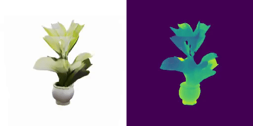

<div align="center">

<h1>
LN3Diff: Scalable Latent Neural Fields Diffusion for Speedy 3D Generation (ECCV 2024)
</h1>

<div>
    <a href='https://github.com/NIRVANALAN' target='_blank'>Yushi Lan</a><sup>1</sup>&emsp;
    <a href='https://hongfz16.github.io' target='_blank'>Fangzhou Hong</a><sup>1</sup>&emsp;
    <a href='https://williamyang1991.github.io/' target='_blank'>Shuai Yang</a><sup>2</sup>&emsp;
    <a href='https://shangchenzhou.com/' target='_blank'>Shangchen Zhou</a><sup>1</sup>&emsp;
    <a href='https://sg.linkedin.com/in/xuyi-meng-673779208' target='_blank'>Xuyi Meng</a><sup>1</sup>&emsp;
    <br>
    <a href='https://daibo.info/' target='_blank'>Bo Dai</a>
    <sup>3</sup>
    <a href='https://xingangpan.github.io/' target='_blank'>Xingang Pan</a>
    <sup>1</sup>
    <a href='https://www.mmlab-ntu.com/person/ccloy/' target='_blank'>Chen Change Loy</a>
    <sup>1</sup> &emsp;
</div>
<div>
    S-Lab, Nanyang Technological University<sup>1</sup>;
    <!-- &emsp; -->
    <br>
    Wangxuan Institute of Computer Technology, Peking University<sup>2</sup>;
    <br>
    <!-- &emsp; -->
    Shanghai Artificial Intelligence Laboratory <sup>3</sup>
    <!-- <br>
     <sup>*</sup>corresponding author -->
</div>

<div>
<!-- <a target="_blank" href="https://colab.research.google.com/github/nirvanalan/E3DGE/blob/main/notebook/CVPR23_E3DGE_Demo.ipynb">
  
</a> -->
<a href="https://hits.seeyoufarm.com"></a>
</div>
<br>
<!-- <h4> -->
<strong>
LN3Diff (Latent Neural Fields 3D Diffusion) is a generic, feedforward 3D LDM framework that creates high-quality 3D object mesh from text within SECONDS.
</strong>
<!-- </h4> -->

<!-- <table>
<tr></tr>
<tr>
    <td>
        
    </td>
    <td>
        
    </td>
    <td>
        
    </td>
    <td>
        
    </td>
    <td>
        
    </td>
</tr>


<tr>
    <td align='center' width='20%'>A standing hund.</td>
    <td align='center' width='20%'>An UFO space aircraft.</td>
    <td align='center' width='20%'>A sailboat with mast.</td>
    <td align='center' width='20%'>An 18th century cannon.</td>
    <td align='center' width='20%'>A blue plastic chair.</td>
</tr>
<tr></tr>
</table> -->

<table>
<tr></tr>
<tr>
    <td>
        
    </td>
    <td>
        
    </td>
    <td>
        
    </td>
    <td>
        
    </td>
    <td>
        
    </td>
</tr>


<tr>
    <td align='center' width='20%'>The eiffel tower.</td>
    <td align='center' width='20%'>A stone waterfall with wooden shed.</td>
    <td align='center' width='20%'>A plate of sushi</td>
    <td align='center' width='20%'>A wooden chest with golden trim</td>
    <td align='center' width='20%'>A blue plastic chair.</td>
</tr>
<tr></tr>
</table>

<!-- <br> -->

For more visual results, go checkout our <a href="https://nirvanalan.github.io/projects/ln3diff/" target="_blank">project page</a> :page_with_curl:

<strike>
Codes coming soon :facepunch:
</strike>

This repository contains the official implementation of LN3Diff: 
Scalable Latent Neural Fields Diffusion for Speedy 3D Generation

</div>

---

<h4 align="center">
  <a href="https://nirvanalan.github.io/projects/ln3diff/" target='_blank'>[Project Page]</a>
  •
  <a href="https://arxiv.org/pdf/2403.12019.pdf" target='_blank'>[arXiv]</a> 
  •
  <a href="https://huggingface.co/spaces/yslan/LN3Diff_I23D" target='_blank'>[Gradio Demo]</a> 
</h4>


## :mega: Updates

[10/2024] Further organize the code and support loading checkpoint directly from huggingface.

[08/2024] We have released the ZeroGPU huggingface demo on I23D, please check it on the [Gradio space](https://huggingface.co/spaces/yslan/LN3Diff_I23D). For local run, simply run ```bash shell_scripts/final_release/inference/gradio_sample_obajverse_i23d_dit.sh```.


[08/2024] We have released the new 3D VAE trained on G-Objaverse full sets, and the corresponding DiT-based T23D and I23D model, trained with flow-matching. Please check the samples below.

[06/2024] LN3Diff got accepted to ECCV 2024 :partying_face:! 

[04/2024] Inference and training codes on Objaverse, ShapeNet and FFHQ are released, including pre-trained model and training dataset.

[03/2024] Initial code release.


### Demo

Check out our online demo on [Gradio space](https://huggingface.co/spaces/yslan/LN3Diff_I23D). To run the demo locally, simply follow the installation instructions below, and afterwards call 

```bash 
bash shell_scripts/final_release/inference/gradio_sample_obajverse_i23d_dit.sh
```


### :dromedary_camel: TODO

- [ ] Polish the dataset preparation and training doc.
- [x] Add Gradio space demo.
- [x] Add Gradio local demo.
- [x] Release the new I23D flow-matching-based DiT model trained with 180K G-Objaverse instances (Aug 2024).
- [x] Release the new T23D DDPM-based DiT model trained with 180K G-Objaverse instances (Aug 2024).
- [x] Release the new 3D VAE trained with 180K G-Objaverse instances (July 2024).
- [x] Release DiT-based, flow-matching based 3D generation framework (July 2024).
- [x] add metrics evaluation scripts and samples.
- [x] Lint the code.
- [x] Release the inference and training code (Apr 2024).
- [x] Release the pre-trained checkpoints of ShapeNet and FFHQ (Apr 2024).
- [x] Release the pre-trained checkpoints of T23D Objaverse model trained with 30K+ instances dataset (Apr 2024).
- [x] Release the stage-1 VAE of Objaverse trained with 80K+ instances dataset (Apr 2024).


## :desktop_computer: Requirements

NVIDIA GPUs are required for this project.
We conduct all the training on NVIDIA V100-32GiB (ShapeNet, FFHQ) and NVIDIA A100-80GiB (G-Objaverse). 
We have test the inference codes on NVIDIA V100.
We recommend using anaconda to manage the python environments.

The environment can be created via ```conda env create -f environment_ln3diff.yml```, and activated via ```conda activate ln3diff```.
If you want to reuse your own PyTorch environment, install the following packages in your environment:

```
pip install -r requirements.txt
# then, install apex from https://github.com/NVIDIA/apex. Note that you should build with cuda support.
```

# :running_woman: Inference

## (Recommended) Single-click inference on Objaverse-trained models

The easiest way for inference on Objaverse model is by launching the gradio demo locally. The checkpoint will be directly downloaded form huggingface. 

```bash 
bash shell_scripts/final_release/inference/gradio_sample_obajverse_i23d_dit.sh
```

For cli inference for image-to-3D:

```bash
bash shell_scripts/final_release/inference/sample_obajverse_i23d_dit.sh
```

For cli inference for text-to-3D:

```bash
bash shell_scripts/final_release/inference/sample_obajverse_t23d_dit.sh
```

Note that for text-to-3D, please manually change the captions condition in ```./scripts/vit_triplane_diffusion_sample_objaverse.py:189```

## Download Models manually & ShapeNet models inference

The pretrained checkpoints can be downloaded via [OneDrive](https://entuedu-my.sharepoint.com/:f:/g/personal/yushi001_e_ntu_edu_sg/ErdRV9hCYvlBioObT1v_LZ4Bnwye3sv6p5qiVZPNhI9coQ?e=YpJ3jz).

Put the downloaded checkpoints under ```checkpoints``` folder for inference. The checkpoints directory layout should be

    checkpoints
    ├── objaverse
    │     ├── model_rec1890000.pt # DiT/L-based 3D VAE 
    │     └── objaverse-dit
    │           └── t23d/model_joint_denoise_rec_model3820000.pt # 
    │           └── i23d/model_joint_denoise_rec_model2990000.pt # 
    ├── shapenet
    │     └── car
    │           └── model_joint_denoise_rec_model1580000.pt
    │     └── chair
    │           └── model_joint_denoise_rec_model2030000.pt
    │     └── plane
    │           └── model_joint_denoise_rec_model770000.pt
    ├── ffhq
    │     └── objaverse-vae/model_joint_denoise_rec_model1580000.pt
    └── ...
    


### Inference Commands

<strong>Note that to extract the mesh, 24GiB VRAM is required.</strong>

## (New) Inference: (Single) Image-to-3D

We train a single-image-conditioned DiT-L/2 on the extracted VAE latents using [flow-matching](https://github.com/willisma/SiT]) framework, for more controllable 3D generation. To inference the results, please run 

```bash
bash shell_scripts/final_release/inference/sample_obajverse_i23d_dit.sh
```

Which reconstructs the 3D assets given input images from ```assets/i23d_examples/for_demo_inference```. The input images are borrowed from [InstantMesh](https://github.com/TencentARC/InstantMesh). The model outputs are shown below (input in the next row.):

<table>
<tr></tr>
<tr>
    <td>
        
    </td>
    <td>
        
    </td>
    <td>
        
    </td>
    <td>
        
    </td>
    <td>
        
    </td>
    <!-- <td>
        
    </td> -->
</tr>

To run 3D reconstruction with your own data, just change the ```$eval_path``` in the above bash file. E.g., change it to ```eval_path=./assets/i23d_examples/instant_mesh_samples``` will do 3D reconstruction on more real images from InstantMesh.
Also, tuning the cfg through ```$unconditional_guidance_scale``` will balance the generation fidelity and diversity.


<tr>
    <td align='center' width='20%'>
        
    </td>
    <td align='center' width='20%'>
        
    </td>
    <td align='center' width='20%'>
        
    </td>
    <td align='center' width='20%'>
        
    </td>
    <td align='center' width='20%'>
        
    </td>
    <!-- <td align='center' width='20%'>
        
    </td> -->
</tr>
<tr></tr>
</table>

We have uploaded the inference results on some common I23D images (from InstantMesh) to [onedrive](https://entuedu-my.sharepoint.com/:u:/g/personal/yushi001_e_ntu_edu_sg/EeMmXvoJ0khNjzWLgMBEgMMB_xb9r9ciRkDgjnQCDJqLSg?e=rk9iGs), including the condition images, rendered images/videos and the corresponding extracted textured mesh (with 4 different seeds, and cfg=5.0). Feel free to use them for comparison in your own method.

## Inference: Text-to-3D

We train text-conditioned 3D latent diffusion model on top of the stage-1 extracted latents. 
For the following bash inference file, to extract textured mesh from the generated tri-plane, set ```--save_img True```. To change the text prompt, set the ```prompt``` variable. For unconditional sampling, set the cfg guidance ```unconditional_guidance_scale=0```. Feel free to tune the cfg guidance scale to trade off diversity and fidelity. 

Note that the diffusion sampling batch size is set to ```4```, which costs around 16GiB VRAM. The mesh extraction of a single instance costs 24GiB VRAM.

### text-to-3D on Objaverse

```bash
bash shell_scripts/final_release/inference/sample_obajverse_t23d_dit.sh
```
which shall reproduce the results shown in the Fig.5 in our paper, using the same text prompts. The results may slightly differ due to random seed used, but the quality are the same. Some output samples are shown in the top figure.


Note that the text prompts are directly hard-coded in the ```scripts/vit_triplane_diffusion_sample_objaverse.py```.

### text-to-3D on ShapeNet

For text-to-3D on ShapeNet, run one of the following commands (which conducts T23D on car, chair and plane.)
```bash
bash shell_scripts/final_release/inference/sample_shapenet_car_t23d.sh
```

```bash
bash shell_scripts/final_release/inference/sample_shapenet_chair_t23d.sh
```

```bash
bash shell_scripts/final_release/inference/sample_shapenet_plane_t23d.sh
```

The output samples for FID, COV/MMD calculation are uploaded [here](https://entuedu-my.sharepoint.com/:f:/g/personal/yushi001_e_ntu_edu_sg/Euc7VaM3SH9EmaJuwC0dG9cBWgyLQY6gsiogGMO4NB-ebA?e=fGh2Rv), which shall reproduce the quantitative results in Tab. 1 in the paper.


### text-to-3D on FFHQ
For text-to-3D on FFHQ, run 

```bash
bash shell_scripts/final_release/inference/sample_ffhq_t23d.sh
```

#### Stage-1 VAE 3D reconstruction

For (Objaverse) stage-1 VAE 3D reconstruction and extract VAE latents for diffusion learning, please run

```bash
bash shell_scripts/final_release/inference/sample_obajverse.sh
```

which shall give the following result:


The marching-cube extracted mesh can be visualized with Blender/MeshLab:


The above VAE input and reconstruction outputs can be found in the [assets/stage1_vae_reconstruction](./assets/stage1_vae_reconstruction) folder.

**!! We upload the pre-extracted vae latents [here](https://entuedu-my.sharepoint.com/:u:/g/personal/yushi001_e_ntu_edu_sg/Ef_7iMZRQT5Bl5YI0hHabQ0B_Y8INDDuaq78gOJaQSPiqg?e=Ef3rXK), which contains the correponding VAE latents (with shape 32x32x12) of 176K G-buffer Objaverse objects. Feel free to use them in your own task.**

For more G-buffer Objaverse examples, download the [demo data](https://entuedu-my.sharepoint.com/:f:/g/personal/yushi001_e_ntu_edu_sg/EoyzVJbMyBhLoKFJbbsq6bYBi1paLwQxIDjTkO1KjI4b1g?e=sJc3rQ).


## :running_woman: Training


### For training stage-1 VAE

For Objaverse, we use the rendering provided by [G-buffer Objaverse](https://aigc3d.github.io/gobjaverse/). 
We process the data into multi-view chunks for faster loading, and the pre-processed data (176K instances) can be downloaded [here](https://entuedu-my.sharepoint.com/:f:/g/personal/yushi001_e_ntu_edu_sg/EtOUTVZNtGxCg3aJnCDkqZcBmH_-OxCGLQBDwqq9ny5Ing?e=BUHiZi). Noted that you need 450 GiB storage to download the dataset.

<!-- A demo subset for stage-1 VAE reconstruction can be downloaded from [here](https://entuedu-my.sharepoint.com/:u:/g/personal/yushi001_e_ntu_edu_sg/Eb6LX2x-EgJLpiHbhRxsN9ABnEaSyjG-tsVBcUr_dQ5dnQ?e=JXWQo1). Note that for Objaverse training, we pre-process the raw data into [wds-dataset](https://github.com/webdataset/webdataset) shards for fast and flexible loading. The sample shard data can be found in [here](https://entuedu-my.sharepoint.com/:f:/g/personal/yushi001_e_ntu_edu_sg/ErtZQgnEH5ZItDqdUaiVbJgBe4nhZveJemQRqDW6Xwp7Zg?e=Zqt6Ss). -->

For ShapeNet, we render our own data with foreground mask for training, which can be downloaded from [here](https://entuedu-my.sharepoint.com/:f:/g/personal/yushi001_e_ntu_edu_sg/EijBXIC_bUNOo0L3wnJKRqoBCqVnhhT_BReYRc1tc_0lrA?e=VQwWOZ). For training, we convert the raw data to LMDB for faster data loading. The pre-processed LMDB file can be downloaded from [here](https://entuedu-my.sharepoint.com/:f:/g/personal/yushi001_e_ntu_edu_sg/Ev7L8Als8K9JtLtj1G23Cc0BTNDbhCQPadxNLLVS7mV2FQ?e=C5woyE).


For FFHQ, we use the pre-processed dataset from [EG3D](https://github.com/NVlabs/eg3d) and compress it into LMDB, which can also be found in the onedrive link above.

### For training stage-2 LDM

#### Pre-extracted latents

We have uploaded the pre-extracted vae latents [here](https://entuedu-my.sharepoint.com/:u:/g/personal/yushi001_e_ntu_edu_sg/Ef_7iMZRQT5Bl5YI0hHabQ0B_Y8INDDuaq78gOJaQSPiqg?e=Ef3rXK), which contains the correponding VAE latents (with shape 32x32x3x4) of 176K G-buffer Objaverse objects. Feel free to use them in the LDM training.

#### text-to-3D
The Cap3D captions can be downloaded from [here](https://entuedu-my.sharepoint.com/:u:/g/personal/yushi001_e_ntu_edu_sg/EdzVtlT_eUpItE73osqE1UEBSNmC2wfQ0YimmMcLcRhpqw?e=wMHtvx). 
Please put under ```'./datasets/text_captions_cap3d.json'```

#### image-to-3D
We directly use G-Objaverse rendering images for training, and you may need to download their data for this experiments.


### Training Commands

Coming soon.

## More discussions of the proposed method
Compared to existing 3D generation framework such as SDS-based ([DreamFusion](https://dreamfusion3d.github.io/)), mulit-view generation-based ([MVDream](https://arxiv.org/abs/2308.16512), [Zero123++](https://github.com/SUDO-AI-3D/zero123plus), [Instant3D](https://instant-3d.github.io/)) and feedforward 3D reconstruction-based ([LRM](https://yiconghong.me/LRM/), [InstantMesh](https://github.com/TencentARC/InstantMesh), [LGM](https://github.com/3DTopia/LGM)), LN3Diff is an origin 3D Diffusion framework. 
Like 2D/Video AIGC pipeline, LN3Diff first trains a 3D-VAE and then conduct LDM training (text/image conditioned) on the learned latent space. Some related methods from the industry ([Shape-E](https://github.com/openai/shap-e), [CLAY](https://github.com/CLAY-3D/OpenCLAY), [Meta 3D Gen](https://arxiv.org/abs/2303.05371)) also follow the same paradigm.
Though currently the performance of the origin 3D LDM's works are overall inferior to reconstruction-based methods, we believe the proposed method has much potential and scales better with more data and compute resources, and may yield better 3D editing performance due to its compatability with diffusion model.


## :handshake: BibTex
If you find our work useful for your research, please consider citing the paper:
```
@inproceedings{lan2024ln3diff,
    title={LN3Diff: Scalable Latent Neural Fields Diffusion for Speedy 3D Generation}, 
    author={Yushi Lan and Fangzhou Hong and Shuai Yang and Shangchen Zhou and Xuyi Meng and Bo Dai and Xingang Pan and Chen Change Loy},
    year={2024},
    booktitle={ECCV},
}
```


## :newspaper_roll:  License

Distributed under the NTU S-Lab License. See `LICENSE` for more information.


## Contact

If you have any question, please feel free to contact us via `lanyushi15@gmail.com` or Github issues.
