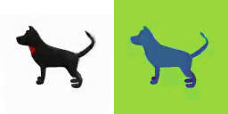

<div align="center">

<h1>
LN3Diff: Scalable Latent Neural Fields Diffusion for Speedy 3D Generation
</h1>

<div>
    <a href='https://github.com/NIRVANALAN' target='_blank'>Yushi Lan</a><sup>1</sup>&emsp;
    <a href='https://hongfz16.github.io' target='_blank'>Fangzhou Hong</a><sup>1</sup>&emsp;
    <a href='https://williamyang1991.github.io/' target='_blank'>Shuai Yang</a><sup>2</sup>&emsp;
    <a href='https://shangchenzhou.com/' target='_blank'>Shangchen Zhou</a><sup>1</sup>&emsp;
    <a href='https://sg.linkedin.com/in/xuyi-meng-673779208' target='_blank'>Xuyi Meng</a><sup>1</sup>&emsp;
    <br>
    <a href='https://xingangpan.github.io/' target='_blank'>Xingang Pan</a>
    <sup>1</sup>
    <a href='https://daibo.info/' target='_blank'>Bo Dai</a>
    <sup>3</sup>
    <a href='https://www.mmlab-ntu.com/person/ccloy/' target='_blank'>Chen Change Loy</a>
    <sup>1</sup> &emsp;
</div>
<div>
    S-Lab, Nanyang Technological University<sup>1</sup>;
    <!-- &emsp; -->
    <br>
    Wangxuan Institute of Computer Technology, Peking University<sup>2</sup>;
    <br>
    <!-- &emsp; -->
    Shanghai Artificial Intelligence Laboratory <sup>3</sup>
    <!-- <br>
     <sup>*</sup>corresponding author -->
</div>

<div>
<!-- <a target="_blank" href="https://colab.research.google.com/github/nirvanalan/E3DGE/blob/main/notebook/CVPR23_E3DGE_Demo.ipynb">
  
</a> -->
<a href="https://hits.seeyoufarm.com"></a>
</div>
<br>
<!-- <h4> -->
<strong>
LN3Diff is a feedforward 3D diffusion model that creates high-quality 3D object mesh from text within 8 V100-SECONDS.
</strong>
<!-- </h4> -->

<table>
<tr></tr>
<tr>
    <td>
        
    </td>
    <td>
        
    </td>
    <td>
        
    </td>
    <td>
        
    </td>
    <td>
        
    </td>
</tr>


<tr>
    <td align='center' width='20%'>A standing hund.</td>
    <td align='center' width='20%'>An UFO space aircraft.</td>
    <td align='center' width='20%'>A sailboat with mast.</td>
    <td align='center' width='20%'>An 18th century cannon.</td>
    <td align='center' width='20%'>A blue plastic chair.</td>
</tr>
<tr></tr>
</table>

<!-- <br> -->

For more visual results, go checkout our <a href="https://nirvanalan.github.io/projects/ln3diff/" target="_blank">project page</a> :page_with_curl:

<strike>
Codes coming soon :facepunch:
</strike>

This repository contains the official implementation of LN3Diff: 
Scalable Latent Neural Fields Diffusion for Speedy 3D Generation

</div>

---

<h4 align="center">
  <a href="https://nirvanalan.github.io/projects/ln3diff/" target='_blank'>[Project Page]</a>
  •
  <a href="https://arxiv.org/pdf/2403.12019.pdf" target='_blank'>[arXiv]</a> 
</h4>


## :mega: Updates

[03/2024] Initial release.

[04/2024] Inference and training codes on Objaverse, ShapeNet and FFHQ are released, including pre-trained model and training dataset.


## :dromedary_camel: TODO

- [x] Release the inference and training code.
- [x] Release the pre-trained checkpoints of ShapeNet and FFHQ.
- [x] Release the pre-trained checkpoints of T23D Objaverse model trained with 30K+ instances dataset.
- [x] Release the stage-1 VAE of Objaverse trained with 80K+ instances dataset.
- [ ] Add Gradio demo.
- [ ] Polish the dataset preparation and training doc.
- [ ] add metrics evaluation scripts and samples.
- [ ] Lint the code.
- [ ] Release the new T23D Objaverse model trained with 80K+ instances dataset.


## :handshake: Citation
If you find our work useful for your research, please consider citing the paper:
```
@misc{lan2024ln3diff,
title={LN3Diff: Scalable Latent Neural Fields Diffusion for Speedy 3D Generation}, 
author={Yushi Lan and Fangzhou Hong and Shuai Yang and Shangchen Zhou and Xuyi Meng and Bo Dai and Xingang Pan and Chen Change Loy},
year={2024},
eprint={2403.12019},
archivePrefix={arXiv},
primaryClass={cs.CV}
}
```

## :desktop_computer: Requirements

NVIDIA GPUs are required for this project.
We conduct all the training on NVIDIA V100-32GiB (ShapeNet, FFHQ) and NVIDIA A100-80GiB (Objaverse). 
We have test the inference codes on NVIDIA V100.
We recommend using anaconda to manage the python environments.

The environment can be created via ```conda env create -f environment_ln3diff.yml```, and activated via ```conda activate ln3diff```.
If you want to reuse your own PyTorch environment, install the following packages in your environment:

```
# first, check whether you have installed pytorch (>=2.0) and xformer.
conda install -c conda-forge openexr-python git
pip install openexr lpips imageio kornia opencv-python tensorboard tqdm timm ffmpeg einops beartype imageio[ffmpeg] blobfile ninja lmdb webdataset opencv-python click torchdiffeq transformers
pip install git+https://github.com/nupurkmr9/vision-aided-gan.
```

## :running_woman: Inference

### Download Models

The pretrained stage-1 VAE and stage-2 LDM can be downloaded via [OneDrive](https://entuedu-my.sharepoint.com/:f:/g/personal/yushi001_e_ntu_edu_sg/ErdRV9hCYvlBioObT1v_LZ4Bnwye3sv6p5qiVZPNhI9coQ?e=nJgp8t).

Put the downloaded checkpoints under ```checkpoints``` folder for inference. The checkpoints directory layout should be

    checkpoints
    ├── ffhq
    │         └── model_joint_denoise_rec_model1580000.pt
    ├── objaverse
    │        ├── model_rec1680000.pt
    │        └── model_joint_denoise_rec_model2310000.pt
    ├── shapenet
    │        └── car
    │                 └── model_joint_denoise_rec_model1580000.pt
    │        └── chair
    │                 └── model_joint_denoise_rec_model2030000.pt
    │        └── plane
    │                 └── model_joint_denoise_rec_model770000.pt
    └── ...
    


### Inference Commands

<strong>Note that to extract the mesh, 24GiB VRAM is required.</strong>

#### Stage-1 VAE 3D reconstruction

For (Objaverse) stage-1 VAE 3D reconstruction and extract VAE latents for diffusion learning, please run

```bash
bash shell_scripts/final_release/inference/sample_obajverse.sh
```

which shall give the following result:


The marching-cube extracted mesh can be visualized with Blender/MeshLab:


**We upload the pre-extracted vae latents at [here](https://entuedu-my.sharepoint.com/:f:/g/personal/yushi001_e_ntu_edu_sg/EnXixldDrKhDtrcuPM4vjQYBv06uY58F1mF7f7KVdZ19lQ?e=nXQNdm), which contains the correponding VAE latents (with shape 32x32x12) of 76K G-buffer Objaverse objects. Feel free to use them in your own task.**

For more G-buffer Objaverse examples, download the [demo data](https://entuedu-my.sharepoint.com/:f:/g/personal/yushi001_e_ntu_edu_sg/EoyzVJbMyBhLoKFJbbsq6bYBi1paLwQxIDjTkO1KjI4b1g?e=sJc3rQ).


#### Stage-2 Text-to-3D

We train 3D latent diffusion model on top of the stage-1 extracted latents. 
For the following bash inference file, to extract mesh from the generated tri-plane, set ```--export_mesh True```. To change the text prompt, set the ```prompt``` variable. For unconditional sampling, set the cfg guidance ```unconditional_guidance_scale=0```. Feel free to tune the cfg guidance scale to trade off diversity and fidelity. 

Note that the diffusion sampling batch size is set to ```4```, which costs around 16GiB VRAM. The mesh extraction of a single instance costs 24GiB VRAM.

For text-to-3D on Objaverse, run

```bash
bash shell_scripts/final_release/inference/sample_obajverse.sh
```

For text-to-3D on ShapeNet, run one of the following commands (which conducts T23D on car, chair and plane.):
```bash
bash shell_scripts/final_release/inference/sample_shapenet_car_t23d.sh
```

```bash
bash shell_scripts/final_release/inference/sample_shapenet_chair_t23d.sh
```

```bash
bash shell_scripts/final_release/inference/sample_shapenet_plane_t23d.sh
```

For text-to-3D on FFHQ, run 

```bash
bash shell_scripts/final_release/inference/sample_ffhq_t23d.sh
```


## :running_woman: Training

### Dataset

For Objaverse, we use the rendering provided by [G-buffer Objaverse](https://aigc3d.github.io/gobjaverse/). A demo subset for stage-1 VAE reconstruction can be downloaded from [here](https://entuedu-my.sharepoint.com/:u:/g/personal/yushi001_e_ntu_edu_sg/Eb6LX2x-EgJLpiHbhRxsN9ABnEaSyjG-tsVBcUr_dQ5dnQ?e=JXWQo1). Note that for Objaverse training, we pre-process the raw data into [wds-dataset](https://github.com/webdataset/webdataset) shards for fast and flexible loading. The sample shard data can be found in [here](https://entuedu-my.sharepoint.com/:f:/g/personal/yushi001_e_ntu_edu_sg/ErtZQgnEH5ZItDqdUaiVbJgBe4nhZveJemQRqDW6Xwp7Zg?e=Zqt6Ss).

For ShapeNet, we render our own data with foreground mask for training, which can be downloaded from [here](https://entuedu-my.sharepoint.com/:f:/g/personal/yushi001_e_ntu_edu_sg/EijBXIC_bUNOo0L3wnJKRqoBCqVnhhT_BReYRc1tc_0lrA?e=VQwWOZ). For training, we convert the raw data to LMDB for faster data loading. The pre-processed LMDB file can be downloaded from [here](https://entuedu-my.sharepoint.com/:f:/g/personal/yushi001_e_ntu_edu_sg/Ev7L8Als8K9JtLtj1G23Cc0BTNDbhCQPadxNLLVS7mV2FQ?e=C5woyE).


For FFHQ, we use the pre-processed dataset from [EG3D](https://github.com/NVlabs/eg3d) and compress it into LMDB, which can also be found in the onedrive link above.


### Training Commands

Coming soon.


## :newspaper_roll:  License

Distributed under the S-Lab License. See `LICENSE` for more information.


## Contact

If you have any question, please feel free to contact us via `lanyushi15@gmail.com` or Github issues.